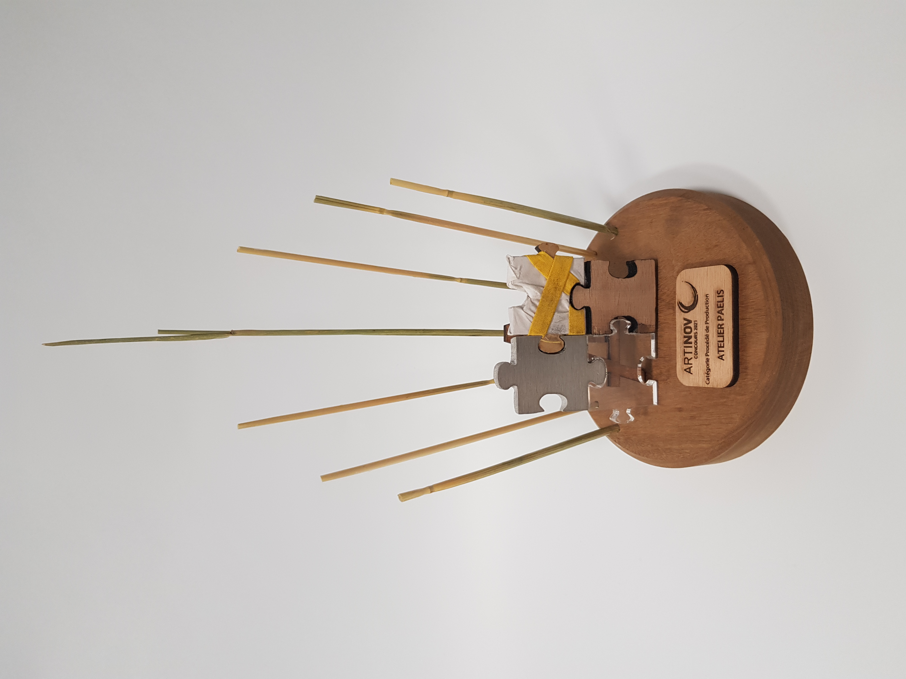

Catégorie Procédé de Production :

L'[Atelier Paelis](https://www.paelis.com/fr) réalise des objets en **marqueterie de paille**. Cette technique d'artisant rare nécessite maîtrise, conaissances et expérience afin de confectionner les plus belles réalisations.

Le trophée proposé inclu un **puzzle** monté sur un **chevalet**. Ce puzzle incluant plusieurs matériau est inspiré de certaines réalisation de l'atelier mélangeant différentes matériaux dans leur réalisations. Une couronne de paille entoure la création afin de rappeler le **savoir-faire principal** de l'entreprise.

