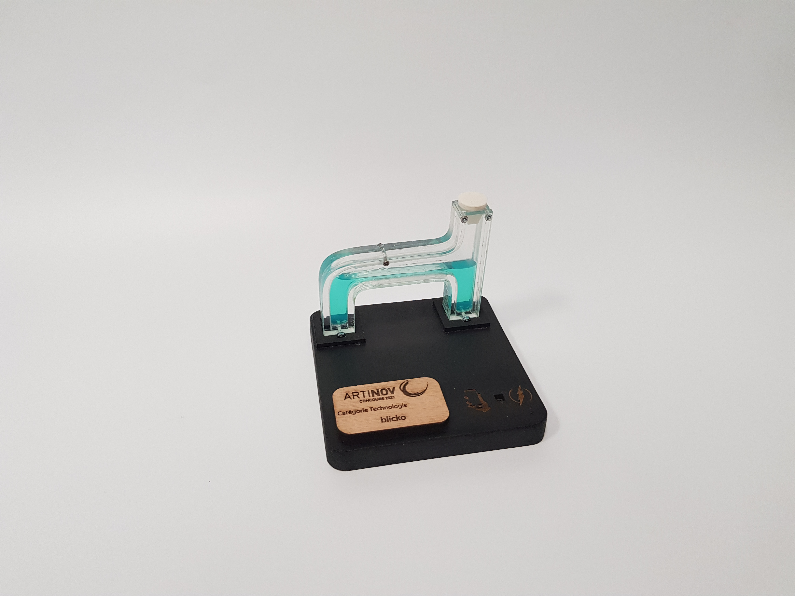

Catégorie **Technologie** 

[**Blicko**](https://www.blicko.fr/) est une entreprise de plomberie qui a développé un service de diagnostique par **visio-conférence**. Ce service permet plus de réactivité et un devis précis établit en amont de la réparation.

Le trophée créé comporte une tuyauterie transparente renfermant un liquide **fluorescent**. 
Afin de souligner l'aspect **technologique** et novateur du service proposé, une fibre optique a été intégrée au socle du trophée afin de pouvoir illuminer le liquide grâce à la lampe de son smartphone.

