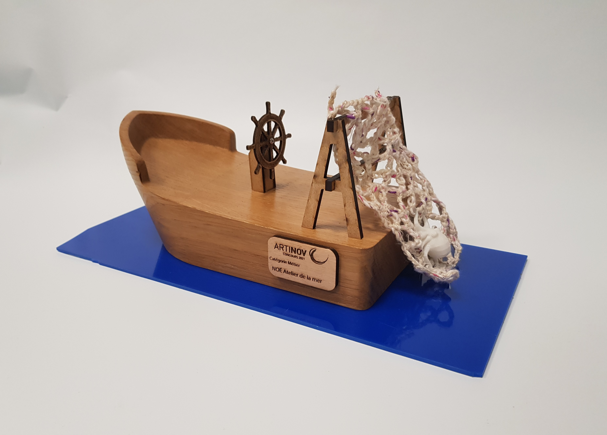

Catégorie Métier

**Noé atelier de la mer** est un lieu dédié à la valorisation de la pêche durable et de l’aquaculture naturelle.  Cet atelier, situé dans le 3ème arrondissement de Lyon, regroupe une **poissonnerie**, une conserverie, un fumoir, et un bar restaurant.

Le thème marin a inspiré le **socle** en forme de bateau. Un filet de pêche confectionné en **crochet** et dans lequel on retrouve la pêche du jour a été ajouté à la composition.

