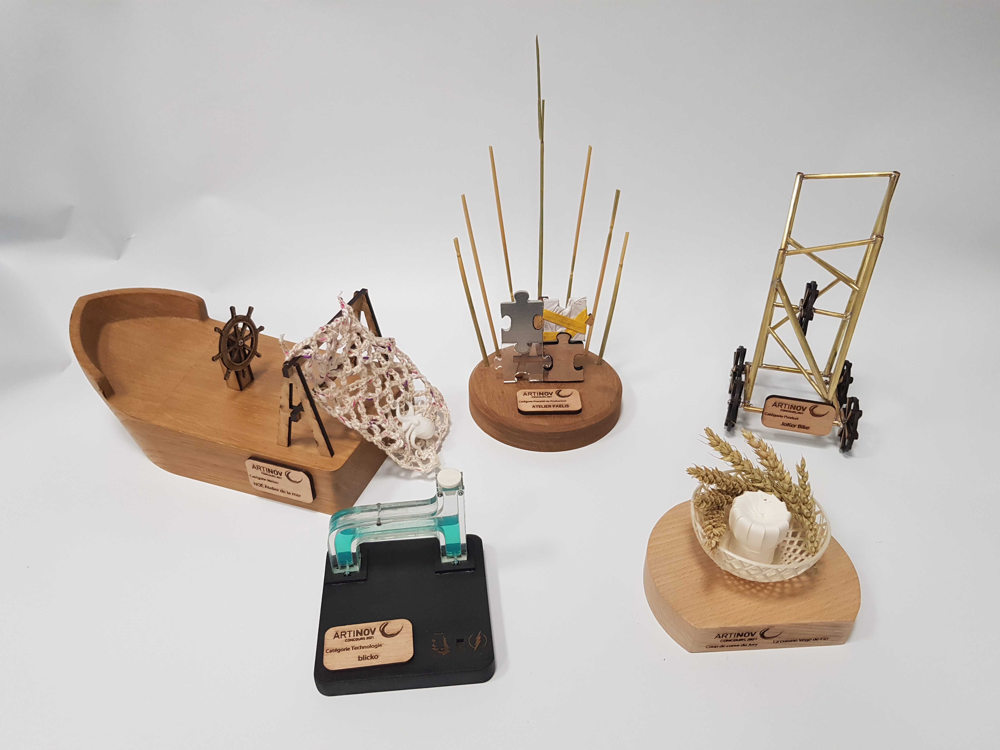

# Artisalab_2021
Concours organisé au FabLab de l'ECL en partenariat avec la chambre des métiers et de l'artisanat (**CMA**). Ce concours se déroule sur 3 semaines et vise à promouvoir l'utilisation du FabLab au sein de l'école.

Le sujet traité par notre équipe était la fabrication de 5 trophée pour le concours **Artinov** organisé par la **CMA** afin de récompenser des artisants innovants. Pour 5 catégories différentes, l'équipe a conçu et réalisé **5 trophées personnalisés** pour chaque entreprise en utilisant différentes techniques de fabrication : usinage CNC, découpe laser, brasage, impression 3D, ...

Nos réalisations nous ont octroyé la **première place** dans le cadre du concours regroupant 6 équipes.

Les catégories et entreprises gagnantes étaient :
- Métier : [Noé Atelier de la Mer](./Noé atelier de la mer/)
- Procédé de Production : [Atelier Paelis](./Atelier PAELIS/)
- Produit : [Joker Bike](./Joker_Bike/)
- Technologie : [Blicko](./Blicko/)
- Prix du Public : [La cuisine végé de Flo](./La cuisine végé de Flo/)

